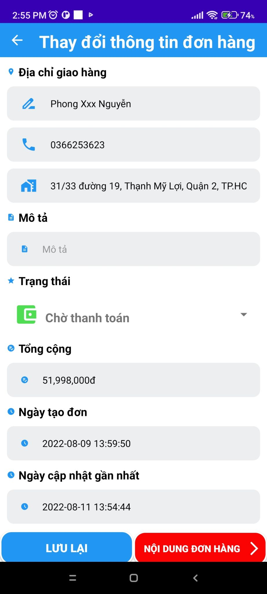

<h1 align="center">Đồ Án Thực Tập 
    Sàn thương mại điện tử Wahoo dành cho nền tảng AndroidOS
</h1>

    

# [**Table Of Content**](#table-of-content)
- [**Table Of Content**](#table-of-content)
- [**Introduction**](#introduction)
- [**Database**](#database)
- [**Features**](#features)
  - [**1. Login**](#1-login)
  - [**2. Sign Up**](#2-sign-up)
  - [**3. Home**](#3-home)
  - [**4. Search \& Search with special conditions**](#4-search--search-with-special-conditions)
  - [**5. Detail**](#5-detail)
  - [**6. Cart**](#6-cart)
  - [**7. Personal**](#7-personal)
- [**Minor Features**](#minor-features)
  - [**1. Order management**](#1-order-management)
  - [**2. Product management**](#2-product-management)
  - [**3. Dark mode**](#3-dark-mode)
  - [**4. Personal Information**](#4-personal-information)
- [Made with 💘 and JAVA ](#made-with--and-java-)

# [**Introduction**](#introduction)

Chào các bạn, mình tên là Nguyễn Thành Phong. Mã sinh viên N18DCCN147, niên khóa 2018-2023. 

Trong mô tả này mình chia sẽ tới các bạn đồ án mà mình thực hiện do nhà trường phân công trong quá trình đi thực tập tại công ty GeoComply. Đồ án này là mô tả chi tiết các chức năng và là một phần bổ trợ cho [**Đồ án thực tập của Phong**](https://github.com/Phong-Kaster/PTIT-Do-An-Thuc-Tap)

Trước khi đi vào các chức năng thì tụi mình cùng nhìn qua về cơ sở dữ liệu nha😆

# [**Database**](#database)

    

<h3 align="center">

***Bản thiết kế tiêu chuẩn cơ sở dữ liệu cho đồ án thực tập***
</h3>

Các bạn có thể thấy rằng cơ sở dữ liệu này ở mức rất cơ bản, dường như độ phức tạp chỉ ngang bằng với một môn học 
ở trường là hết cỡ 😂. 

Một lý do nữa, có thể coi là nguyên tắc bất thành văn, đồ án thực tập & sau này là đồ án tốt nghiệp phải được triển khai với mô hình **Restful API**.
Các thầy cô sẽ không đồng thuận để chúng ta làm đồ án theo phương thức truyền thống nữa - tức là viết luôn phần xử lý trực tiếp trong sản phẩm đầu cuối luôn( website, application,..)

Lý do cuối cùng là mình làm đồ án này hoàn toàn từ đầu 😎, nên cơ sở dữ càng đơn giản ( nhưng phải đủ yêu cầu đề tài ) thì chức năng sẽ càng ít.

> Note: Trong quá trình làm đồ án mình có hỏi các bạn học của mình thì nhiều đứa lấy luôn đồ án cũ ra để nộp, hầu hết là lấy đồ án từ môn [**Phát triển phần mềm hướng dịch vụ**](https://github.com/Phong-Kaster/PTIT-Phat-Trien-Phan-Mem-Huong-Dich-Vu-Website) & kèm thêm một số chỉnh sửa. Sau đó thì đem nộp 😜

Ở phần tiếp theo, mình sẽ trình bày với các bạn về những module xử lý quan trọng nhất của đồ án này. Những phần khác mình không đề cập vì đơn giản là chúng chỉ là các chức năng thêm - xóa - sửa đơn thuần và không có thuật toán hay chỗ nào xử lý quá phức tạp & để dễ hình dung cái mindset của Phong. 

# [**Features**](#features)

## [**1. Login**](#1-login)

Đầu tiên, luôn là chức năng bắt buộc phải có đối với mọi ứng dụng thuộc bất kì nền tảng nào. Đó là chức năng đăng nhập để 
ứng dụng nhận diện danh tính người dùng trên không gian mạng.

    

<h3 align="center">

***Hỗ trợ hai lựa chọn đăng nhập🔐***
</h3>

Để đăng nhập, ứng dụng cho người dùng hai sự lựa chọn: 

1. Đăng nhập bằng tài khoản & mật khẩu truyền thống

2. Đăng nhập bằng tài khoản Google

Với chức năng đăng nhập Google, ứng dụng sử dụng Google API để hoạt động và sẽ hiển thị một cửa 
sổ để người dùng lựa chọn tài khoản đăng nhập

    

<h3 align="center">

***Lựa chọn tài khoản Google làm tên đăng nhập🧧***
</h3>

Trường hợp người dùng chưa có bất kì tài khoản Google nào trên thiết bị. Ứng dụng sẽ chuyển hướng 
tới website của Google để tiến hành đăng nhập

    

<h3 align="center">

***Tự động chuyển hướng tới website Google để tiến hành đăng nhập***
</h3>

Qúa trình đăng nhập hoàn tất, người dùng sẽ được tự động chuyển tới trang chủ của ứng dụng và một thông 
báo sẽ hiển thị để người dùng nhận biết rằng họ đã đăng nhập thành công với tài khoản Google.

    

<h3 align="center">

***Tự động chuyển hướng tới website Google để tiến hành đăng nhập***
</h3>

## [**2. Sign Up**](#2-sign-up)

Với tùy chọn đăng nhập bằng tài khoản & mật khẩu truyền thống. Sàn thương mại điện tử Wahoo hỗ trợ cho người sử dụng 
đăng kí trực tiếp với các thông tin cơ bản như sau: 

    

<h3 align="center">

***Đăng ký tài khoản dễ dàng ngay trên ứng dụng🔐***
</h3>

## [**3. Home**](#3-home)

Màn hình chính sẽ hiển thị các thông tin nổi bật của sàn thương mại. Ở đây, sản phẩm chính mà sàn thương mại Wahoo cung cấp 
sẽ là máy tính xách tay/laptop. Ngoài ra, ứng dụng cũng hỗ trợ các tùy chọn nổi bật để người dùng dễ dàng tìm các sản phẩm theo 
nhu cầu cá nhân như: Gaming, văn phòng, design,...

    

<h3 align="center">

***Hiển thị nhiều tùy chọn phù hợp với như cầu cá nhân🎯🕹🎮***
</h3>

## [**4. Search & Search with special conditions**](#4-search--search-with-special-conditions)

🔍 Tìm kiếm là một chức năng khác cũng tương đối quan trọng trong ứng dụng. 
 

    

<h3 align="center">

***Tìm kiếm dựa trên các danh mục sẵn có 🏷🔖***
</h3>

Với ứng dụng Wahoo, người sử dụng có thể tìm kiếm sản phẩm mong muốn bằng hai cách:

1. Tìm kiếm bằng cách nhập từ khóa 

2. Tìm kiếm với các điều kiện cấu hình tương ứng.

    
    
    

<h3 align="center">

***Hoặc tìm kiếm nâng cao bằng cách chỉ định các thông số kĩ thuật 🏷🔖***
</h3>

## [**5. Detail**](#5-detail)

Sau khi tìm kiếm đúng sản phẩm thì chúng ta sẽ cần xem chi tiết sản phẩm đó( Dĩ nhiên rồi🤣). 
Phần này giới thiệu tới các bạn về cách mà `Wahoo` hiển thị chi tiết sản phẩm cho khách hàng.

    

<h3 align="center">

***Xem chi tiết sản phẩm 🏷🔖***
</h3>

Khi trượt xuống bên dưới người dùng có thể tìm ra các sản phẩm tương tự như sản phẩm đang xem 

    

<h3 align="center">

***Trượt xuống để xem sản phẩm tương tự 🤪***
</h3>

Bằng cách nhấn vào nút **Thêm vào giỏ hàng**, người dùng cũng có thể quyết định số lượng sản phẩm được cho vào giỏ hàng 
với số lượng tùy ý.

    

<h3 align="center">

***Thêm vào giỏ hàng 🛒1️⃣8️⃣9️⃣6️⃣***
</h3>

## [**6. Cart**](#6-cart)

Sàn thương mại nào cũng sẽ cần có giỏ hàng để phục vụ cho khách hàng kiểm tra và tiến hành thanh toán. 
`Wahoo` cũng không nằm ngoài điều này. 

    

<h3 align="center">

***Giỏ hàng - chức năng không thể thiếu trong các ứng dụng thương mại điện tử 🛒***
</h3>

Với màn hình này, khách hàng có thể thêm số lượng hoặc xóa bỏ món hàng bằng cách vuốt từ phải qua. Ngoài ra,
khách hàng có thể chọn nút **Thanh toán** sau khi đã chọn được món hàng ưng ý.

    

<h3 align="center">

***Kiểm tra các thông tin cần thiết trước khi xác nhận thanh toán ✅***
</h3>

Hệ thống sẽ tiến hành kiểm tra số lượng tồn của sản phẩm và trả về kết quả phù hợp:

- Nếu một trong các sản phẩm bị thiếu thì sẽ hiện thông báo 

- Nếu tất cả sản phẩm đặt mua nằm trong danh mục mong muốn thì trả kết quả thành công

    

<h3 align="center">

***Thanh toán thành công ✅☑✅☑***
</h3>

## [**7. Personal**](#7-personal)

Phần này chứa toàn bộ các chức năng liên quan tới cá nhân người sử dụng

    

<h3 align="center">

***Các chức năng cá nhân***
</h3>

Hình ảnh bên trên thể hiện các chức năng khác mà ứng dụng hỗ trợ người dùng như: 

1. **Tất cả hóa đơn** - Cho phép người dùng xem toàn bộ các đơn hàng mà bản thân đã mua

2. **Chế độ ban đêm** - Bật tắt chế độ ban đêm bằng cách ấn vào

3. **Thông tin cá nhân** - Cập nhật thông tin cá nhân

4. **Ngôn ngữ** - Tùy chọn ngôn ngữ ứng dụng của hệ thông

5. **Quản lý đơn hàng** - Chỉ dành cho Admin, quản lý các đơn hàng khi bạn là người bán

6. **Quản lý sản phẩm** - Chỉ dành cho Admin, chỉnh sửa thông tin sản phẩm đang bày bán trên sàn thương mại

# [**Minor Features**](#minor-features)

## [**1. Order management**](#1-order-management)

Chức năng này được dùng để quản lý các đơn hàng có trên sàn. Quản trị viên có thể thao tác thêm - xóa - sửa trực tiếp trên điện thoại.

    

<h3 align="center">

***Quản lý đơn hàng trực tiếp trên sản phẩm🛒***
</h3>

Chúng ta cũng có thể xem chi tiết đơn hàng khi ấn vào nút tương ứng

    

<h3 align="center">

***Dễ dàng xem chi tiết sản phẩm***
</h3>

Nếu phát hiện sự bất thường hoặc khách hàng có yều thay đổi thông tin như địa chỉ liên lạc, số lượng sản phẩm, ...
quản trị viên hoàn toàn có thể thay đổi thông tin theo ý khách hàng.

    

<h3 align="center">

***Sửa thông tin, cập nhật tình trạng đơn hàng trực tiếp trên di động🎊***
</h3>

Nếu thực hiện hành động không có khả năng phục hồi như chức năng **XÓA**. Ứng dụng sẽ luôn hiển thị thông báo 
để nhắc nhở quản trị viên về hành động này.

    

<h3 align="center">

***Luôn nhắc nhở khi thực hiện các thao tác có thể tác động lớn tới dữ liệu ⚠***
</h3>

## [**2. Product management**](#2-product-management)

Quản trị viên cũng có thể dễ dàng thêm hoặc chỉnh sửa thông tin của sản phẩm trực tiếp trên di động với đầy đủ các thông tin sản phẩm như sau:

    
    

<h3 align="center">

***Chinh sửa thông tin sản phẩm như: ảnh đại diện 🙋‍♂️, giá bán💲, ...***
</h3>

Nếu dữ liệu đầu vào hợp lệ thì sẽ hiển thị thông báo thành công

    

<h3 align="center">

***Lưu dữ liệu thành công😆***
</h3>

## [**3. Dark mode**](#3-dark-mode)

Chế độ ban đêm của ứng dụng mới màu nền chuyển sang màu đen tuyền và chữ trắng để người dùng dễ dàng 
sử dụng ở nơi có ánh sáng thấp.

    
    
    

<h3 align="center">

***Chế độ ban đêm 🌙***
</h3>

## [**4. Personal Information**](#4-personal-information)

Chức năng cập nhật thông tin cá nhân thì như tên gọi. Phong cũng không biết mô tả gì thêm.

    

<h3 align="center">

***Có avatar đẹp hơn thì cập nhật liền đi🤔***
</h3>

# [Made with 💘 and JAVA ](#)